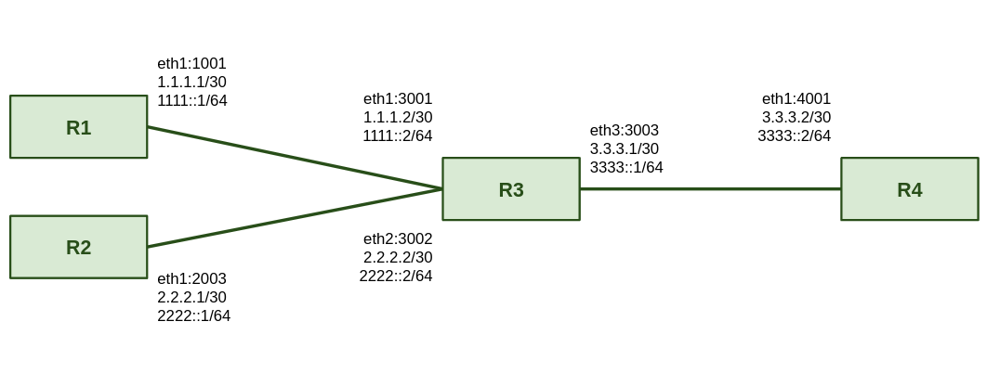

# FreeRouter-Prometheus
Documentation prometheus integrat with FreeRouter
- [FreeRouter](http://www.freertr.net/)
 
 
 
## Configuration and Install FreeRouter
To work the FreeRtr just have java
 
 
Linux    
apt-get install default-jre-headless --no-install-recommends
 
 
## FreeRouter topology
 

   

 
 
 
## Topology Configuration
- [R1](https://github.com/Tetzdesen/FreeRouter-Prometheus/tree/main/topology/r1)
- [R2](https://github.com/Tetzdesen/FreeRouter-Prometheus/tree/main/topology/r2)
- [R3](https://github.com/Tetzdesen/FreeRouter-Prometheus/tree/main/topology/r3)
- [R4](https://github.com/Tetzdesen/FreeRouter-Prometheus/tree/main/topology/r4)
 
## Dependencies and technologies

 

 
- [Docker](https://react-pdf.org/)
- [Docker-Compose](https://docs.docker.com/compose/)
 
 
## Install Docker and docker-compose
sudo apt install docker.io  
sudo apt install docker-compose
 
## Prometheus Configuration
- [prometheus.yml](https://github.com/Tetzdesen/FreeRouter-Prometheus/tree/main/prometheus)
 
 
## Docker Compose file
- [docker-compose.yml](https://github.com/Tetzdesen/FreeRouter-Prometheus/tree/main/prometheus)
 
## Run configuration
### Start Router 1
 
## Run configuration
### Start Router 1
 
## Run configuration
### Start Router 1