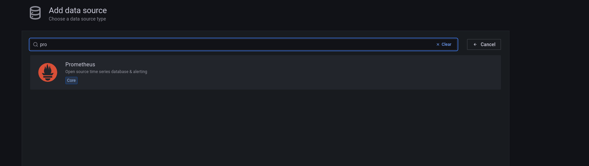
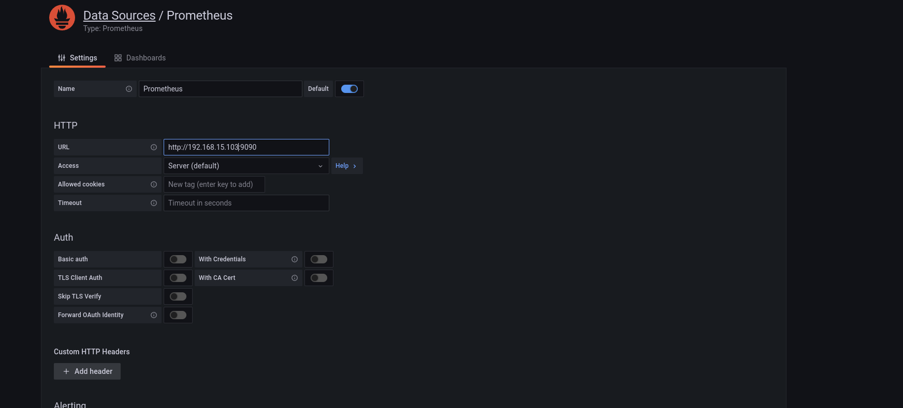
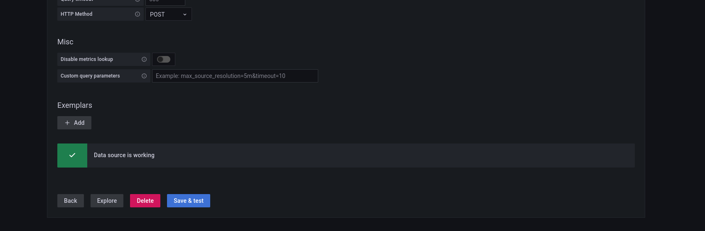
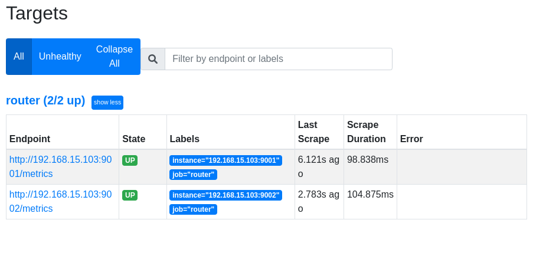
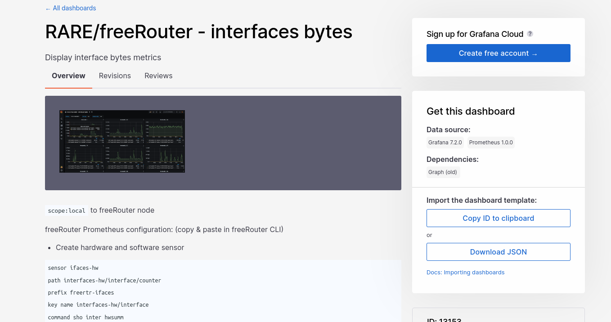
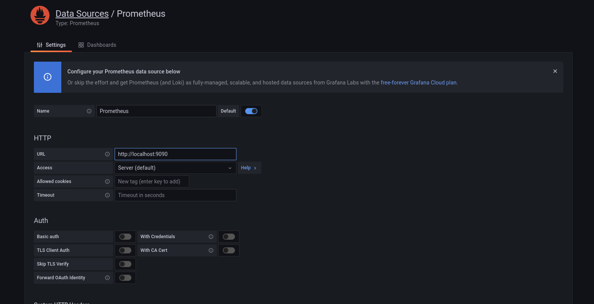

# FreeRouter-Prometheus

## Overview FreeRouter

#### freeRouter is a free, open source router os process. it speaks routing protocols, and (re)encapsulates packets on interfaces.

</br>

## Requirements
#### To run this experiment, it is necessary to use a Debian-based Linux operating system.

</br>

## Configuration and Install FreeRouter

#### To work the FreeRtr just have java.
#### Consult the freerouter documentation for installing java:

- [FreeRouter](http://www.freertr.net/)


#### Install the latest and greatest Java Runtime Environment (JRE).
```
$ sudo apt-get install --no-install-recommends --no-install-suggests --yes default-jre-headless
```
#### Download the freeRouter jar binary.
```
$ wget http://www.freertr.net/rtr.jar
```
</br>

## Experiment Topology

<div style='display: inline-block'>
   
</div>
 
</br>
 
## Topology Configuration
- [R1](https://github.com/Tetzdesen/FreeRouter-Prometheus/tree/main/topology/r1)
- [R2](https://github.com/Tetzdesen/FreeRouter-Prometheus/tree/main/topology/r2)
 
## Dependencies and technologies


- [Docker](https://www.docker.com/)
- [Docker-Compose](https://docs.docker.com/compose/)
- [Prometheus](https://prometheus.io/)
- [Grafana](https://grafana.com/grafana/)

## Install Docker and docker-compose

``` 
$ sudo apt install docker.io 
``` 
```
$ sudo apt install docker-compose 
```


## Prometheus Configuration
- [prometheus.yml](https://github.com/Tetzdesen/FreeRouter-Prometheus/tree/main/prometheus)
 
 
## Docker Compose file
- [docker-compose.yml](https://github.com/Tetzdesen/FreeRouter-Prometheus/tree/main/prometheus)

## Start Deploy

```
$ git clone https://github.com/Tetzdesen/FreeRouter-Prometheus.git
$ cd FreeRouter-Prometheus
```

## Move directory prometheus for /etc
```
$ sudo mv prometheus /etc
```

- Check the IP from your interface
```
$ ifconfig
```

- Change the IP in the prometheus.yml file with your preferred text editor

```
$ sudo nano /etc/prometheus/prometheus.yml
```
## Start Docker Container's
```
$ cd docker
$ sudo docker-compose up -d
```
## Check Container's
```
$ sudo docker ps
```
## Run Configuration Router's
### Start Router's Configuration
- R1
```
$ java -jar <path>/rtr.jar routersc topology/r1/r1-hw.txt topology/r1/r1-sw.txt 
```
- R2
```
$ java -jar <path>/rtr.jar routersc topology/r2//r2-hw.txt topology/r2/r2-sw.txt 
```
## Grafana Configuration 
#### Access http://127.0.0.1:3000 
- User: admin 
- Password: freerouter

- Once installed configure Prometheus as Grafana data source.
<div style='display: inline-block'>
   
</div>

</br>

- Fill in all the prometheus server information.
<div style='display: inline-block'>
   
</div>

</br>

- Check the the data source is defined correctly by clicking the "Save & test" button.
<div style='display: inline-block'>
   
</div>

</br>

## Verification

### Verification Prometheus
- Access Prometheus - http://127.0.0.1:9090

- Access Targets

- Verify router's up

<div style='display: inline-block'>
   
</div>

</br>

### Verification Grafana

- Download freeRouter interface bytes dashboard [here.](https://grafana.com/grafana/dashboards/13153)
<div style='display: inline-block'>
   
</div>

</br>

- Access Grafana - http://127.0.0.1:3000


- Import Dashboard RARE/freeRouter 
<div style='display: inline-block'>
   
</div>

</br>

- Dashboard Verify
<div style='display: inline-block'>
   
</div>


