# Grafana Configuration Alerts 

- Create folder for alerts - Click new Folder

   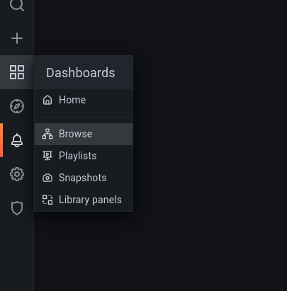

 

   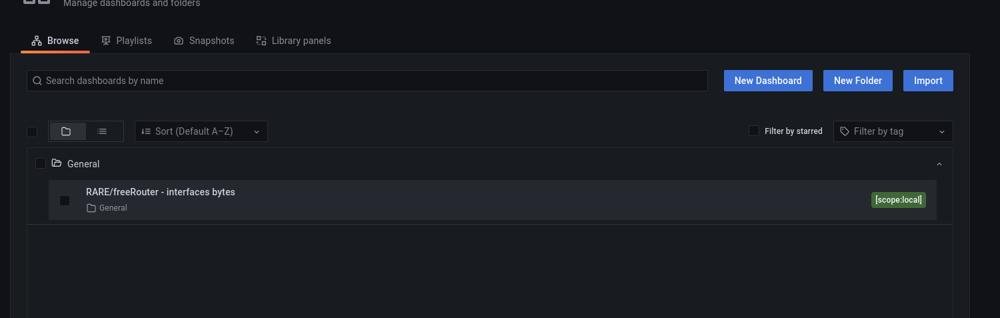

 

   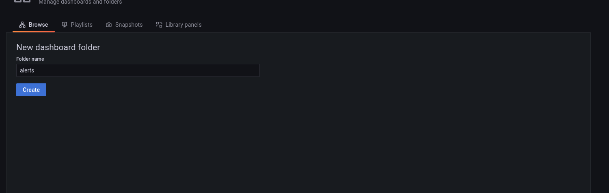

 

- Access Alerting Painel in Grafana

   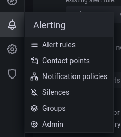

 

- Click New alert rule

   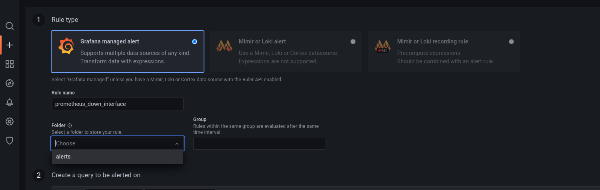

 

- Select folder alerts 

   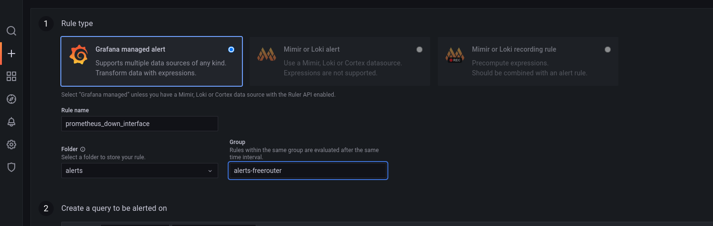

 

- Configure metrics browser alert

   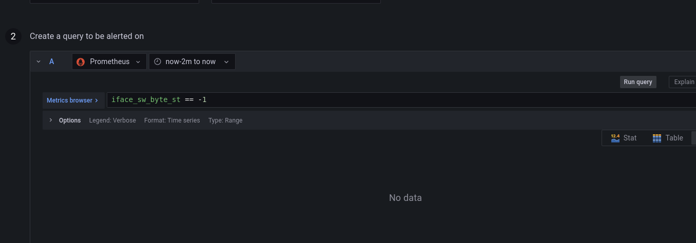

 

- Set now-2m for query alert

   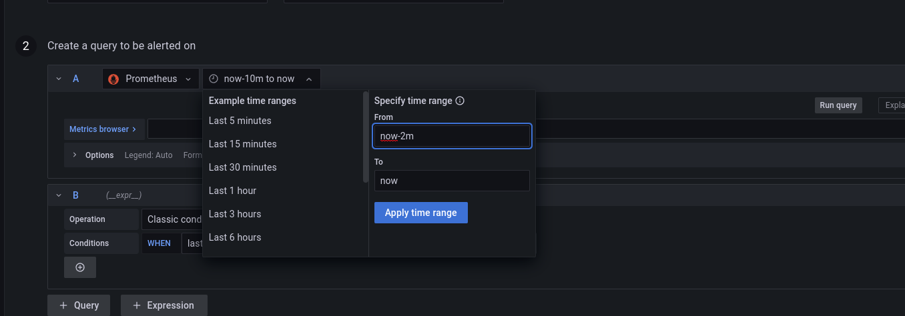

 

- Set Description alert 

   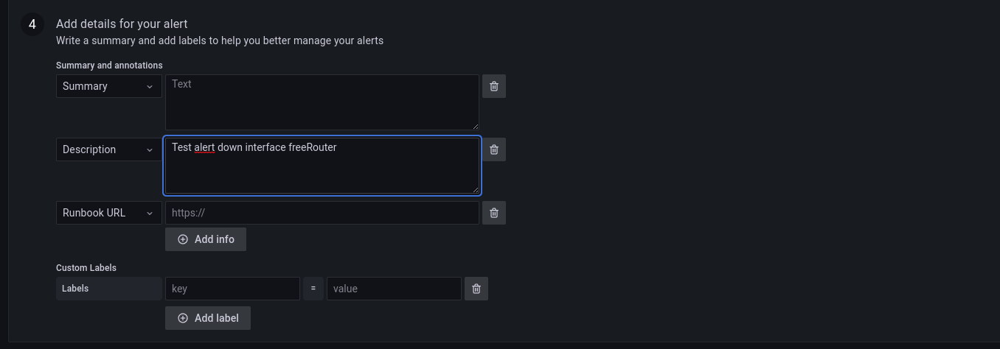

 

- Save

   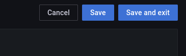

 

- Check alerts view grafana

   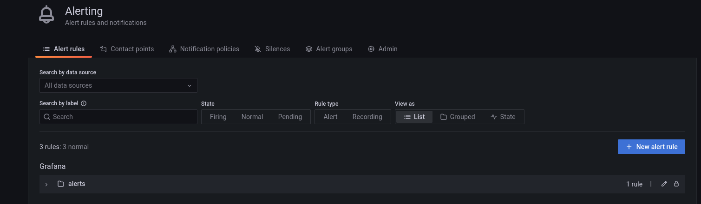

 

   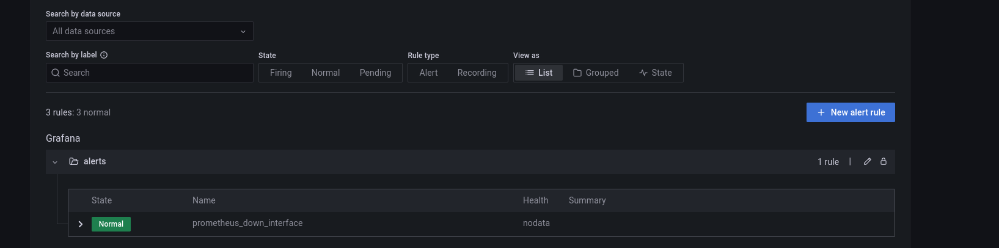
</div