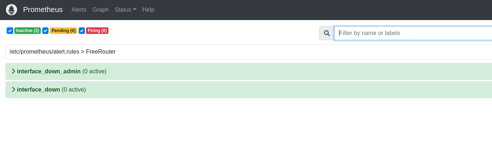
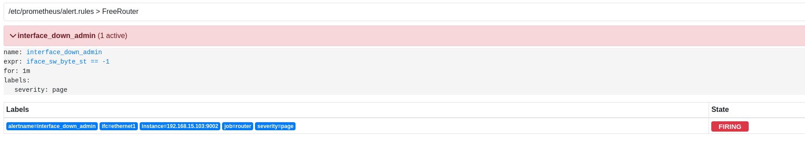

# INTEGRATION ALERTMANAGER, FREEROUTER AND PROMETHEUS


## Overview FreeRouter

#### As seen in the tutorial: https://github.com/rare-freertr/freeRtr-prometheus we can integrate prometheus with freeRtr. From this point, we can evolve to a tutorial involving the alert manager of prometheus (AlertManager), since it allows the integration with an alert manager.

</br>

## Requirements
#### To run this experiment, it is necessary to use a Debian-based Linux operating system.

</br>

## Configuration and Install FreeRouter

#### To work the FreeRtr just have java.
#### Consult the freerouter documentation for installing java:

- [FreeRouter](http://www.freertr.net/)


#### Install the latest and greatest Java Runtime Environment (JRE).
```
$ sudo apt-get install --no-install-recommends --no-install-suggests --yes default-jre-headless
```
#### Download the freeRouter jar binary.
```
$ wget http://www.freertr.net/rtr.jar
```
</br>

## Experiment Topology

<div style='display: inline-block'>
   
</div>
 
</br>
 
## Topology Configuration
- [R1](https://github.com/Tetzdesen/FreeRouter-Prometheus/tree/main/topology/r1)
- [R2](https://github.com/Tetzdesen/FreeRouter-Prometheus/tree/main/topology/r2)
 

## Install Docker and docker-compose

``` 
$ sudo apt install docker.io 
``` 
```
$ sudo apt install docker-compose 
```


## Prometheus Configuration

```
$ sudo nano /etc/prometheus.yml
```

- Paste:

```
global:
    scrape_interval: 5s
    evaluation_interval: 15s
rule_files:
    - 'alert.rules'
alerting:
  alertmanagers:
    - scheme: http
      static_configs:
        - targets: [ 'alertmanager:9093' ]
scrape_configs:
  - job_name: 'router'
    metrics_path: /metrics
    scrape_interval: 15s
    static_configs:
    - targets: ['yourip:9001', 'yourip:9002']
      labels:
```

## AlertManager Configuration

### Create alertmanager configuration directory 

```
$ sudo mkdir /etc/alertmanager
```
 
### Create file configuration config.yml

```
$ sudo touch /etc/alertmanager/config.yml
```

```
route:
 
   receiver: 'slack'
 
receivers:
 
   - name: 'slack'
 
     slack_configs:
 
         - send_resolved: true
 
           username: 'YOUR USERNAME'
 
           channel: '#YOURCHANNEL'
 
           api_url: 'INCOMMING WEBHOOK'
``` 
- Check at: https://api.slack.com/messaging/webhooks, how to create an INCOMMING WEBHOOK.

### Configuration Alerts Rules

```
$ sudo nano /etc/prometheus/alert.rules
```

```
groups:
- name: FreeRouter
  rules:
  # Alert for any instance that is unreachable for >5 minutes.
  - alert: interface_down_admin
    expr: iface_sw_byte_st == -1
    for: 1m
    labels:
      severity: page
 
  # Alert for any instance that is unreachable for >5 minutes.
  - alert: interface_down
    expr: iface_sw_byte_st == 0
    for: 1m
    labels:
      severity: page
```
 
## Docker Compose file
- [docker-compose.yml]()

- Edit Docker Compose file:

```
$ sudo nano docker/docker-compose.yml
```

- Paste

```
  alertmanager:
    image: prom/alertmanager:latest
    container_name: alertmanager
    restart: always
    ports:
      - "9093:9093"
    command:
    - --config.file=/etc/alertmanager/alertmanager.yml
    volumes:
    - /etc/alertmanager/alertmanager.yml:/etc/alertmanager/alertmanager.yml:ro
    depends_on:
    - prometheus
```

## VERIFICATION 

### Start Container’s

```
$ cd docker
$ sudo docker-compose up -d
```


### Start Router's Configuration

- R1

```
$ java -jar <path>/rtr.jar routersc topology/r1/r1-hw.txt topology/r1/r1-sw.txt 
```


- R2

```
$ java -jar <path>/rtr.jar routersc topology/r2//r2-hw.txt topology/r2/r2-sw.txt 
```

### AlertManager Verification

- Access: http://localhost:9090

#### Check the alerts panel:

<div style='display: inline-block'>
   
</div>

</br>

### Then enter the second router and turn off the eth1 interface:
- Access telnet 127.0.0.1 2223 (router two):

```
$ telnet 127.0.0.1 2223
```

- Access configure terminal:

```
r2# conf t
```

#### Access interface Ethernet1:

```
r2(cfg)# int eth1
```

#### Shutdown interface:

```
r2(cfg-if)# shutdown
```

### Wait alert is active:

- Access http://localhost:9090
<div style='display: inline-block'>
   
</div>

</br>

- Access http://127.0.0.1:9093


<div style='display: inline-block'>
   
</div>

</br>

- Access slack chat:

<div style='display: inline-block'>
   
</div>
